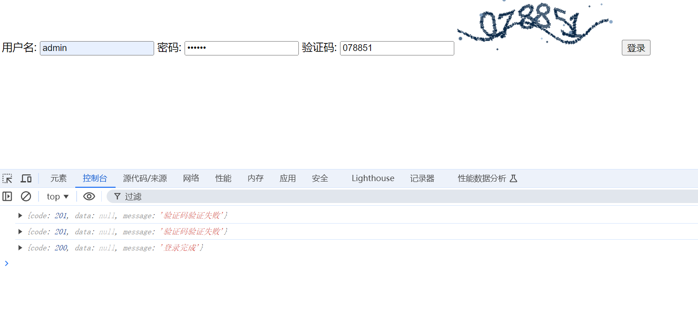

# CaptchaUtil 项目包

- [验证码](#CAPTCHA)


## Usage

针对验证码、二维码、条形码工具的使用


### CAPTCHA

支持语音和图片验证码

* 登录html页面
```html

<!DOCTYPE html>
<html lang="en">
<head>
    <meta charset="UTF-8">
    <title>Login Page</title>
</head>
<body>
    <form id="loginForm">
        <label for="username">用户名:</label>
        <input type="text" id="username" name="username">
        <label for="password">密码:</label>
        <input type="password" id="password" name="password">
        <label for="captcha">验证码:</label>
        <input type="text" id="captcha" name="captcha">
        <input type="hidden" id="captchaId" name="captchaId">
        
        <button type="button" onclick="login()">登录</button>
    </form>
</body>
<script src="//cdn.staticfile.org/jquery/1.10.2/jquery.min.js"></script>
<script>
   var baseUrl = "http://localhost:8000"

   $(document).ready(function(){
        refreshCaptcha()
   })


   function refreshCaptcha() {
        $.ajax({
                url: baseUrl + "/captchaId",
                type: "GET",
                success: function(res) {
                var obj =  JSON.parse(res)
                $("#captchaId").attr("value",obj.data)
                $("#captchaImg").attr("src", baseUrl + "/captcha/" + obj.data + ".png")
                }
            })
   }
   

   function login() {
    $.ajax({
            url: baseUrl + "/login",
            type: "POST",
            data: JSON.stringify({
                "username": $("#username").val(),
                "password": $("#password").val(),
                "captcha": $("#captcha").val(),
                "captchaId": $("#captchaId").val(),
            }),
            success: function(res) {
               var obj =  JSON.parse(res)
               console.log(obj)
            }
        })
   }
</script>
</html>
```

* 服务端代码
```go
// 请求返回
func ResponseReturn(code int, message string, data interface{}) []byte {
	result := map[string]interface{}{"code": code, "message": message, "data": data}
	v, _ := json.Marshal(result)
	return v
}

// 路由设置
func InitRouter() {
	// 获取验证码ID
	http.HandleFunc("/captchaId", func(w http.ResponseWriter, r *http.Request) {
		w.Write(ResponseReturn(200, "获取验证码ID完成", DefaultCaptcha.GetCaptchaId()))
	})

	// 图片或语音验证码刷新地址
	// 图片地址 /captcha/{captchaId}.png
	// 语音地址 /captcha/{captchaId}.wav?lang=zh
	http.Handle("/captcha/", DefaultCaptcha)

	// 登录验证
	http.HandleFunc("/login", func(w http.ResponseWriter, r *http.Request) {

		param := map[string]string{}
		json.NewDecoder(r.Body).Decode(&param)

		verifyCaptcha := DefaultCaptcha.VerifyString(param["captchaId"], param["captcha"])

		if !verifyCaptcha {
			w.Write(ResponseReturn(201, "验证码验证失败", nil))
			return
		}

		if param["username"] == "admin" && param["password"] == "123456" {
			w.Write(ResponseReturn(200, "登录完成", nil))
		} else {
			w.Write(ResponseReturn(201, "账号密码错误", nil))
		}

	})

	// 静态文件地址
	fileHandler := http.FileServer(http.Dir("./"))
	http.Handle("/", fileHandler)
}

func main() {
    InitRouter(t)
	http.ListenAndServe(":8000", nil)
}

```

执行效果如下



